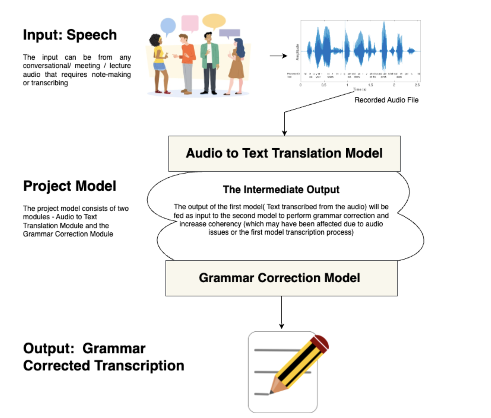

# ECS289G - Fall2023 - DeepLearning - Project
# Deep Learning for Automated Meeting Transcription
### Authors and Contributors
Rohith Raj Srinivasan and Shreyas Madhav Ambattur Vijayanand
## Overview

This ECS 289G project that addresses the challenges of manual transcription in meetings, lectures, and in-person hearings. It introduces a comprehensive deep learning system for speaker diarization, speaker audio transcription, and automatic grammar correction. The project aims to significantly reduce the time and effort traditionally required for transcribing spoken content.

## Key Features

1. **Speaker Diarization**: The system provides the ability to diarize and differentiate between multiple speakers in an audio recording.

2. **Automatic Speech Recognition (ASR)**: Utilizing a Convolutional Neural Network-Recurrent Neural Network (CNN-RNN) approach, the system achieves accurate and efficient transcription of audio content.

3. **Grammar Correction**: To enhance coherency and readability, a Transformer-based grammar correction module with Rule-Based Checking is incorporated into the transcription process.

4. **Language Translation**: The project includes a feature to translate transcriptions from English to other languages, providing flexibility for users with diverse language requirements.

5. **Output Format**: The final output is generated in the form of a PDF, containing grammar-corrected and coherent transcriptions along with additional notes.

## Results

The system demonstrates impressive results in both automatic speech recognition and grammar error correction, with Word Error Rate (WER) of 0.0247, Character Error Rate (CER) of 0.0959, and Grammar Error Correction using GLEU scores of 55.02 for pretrained BERT+Rule Check and 40.70 for Finetuned T5.
